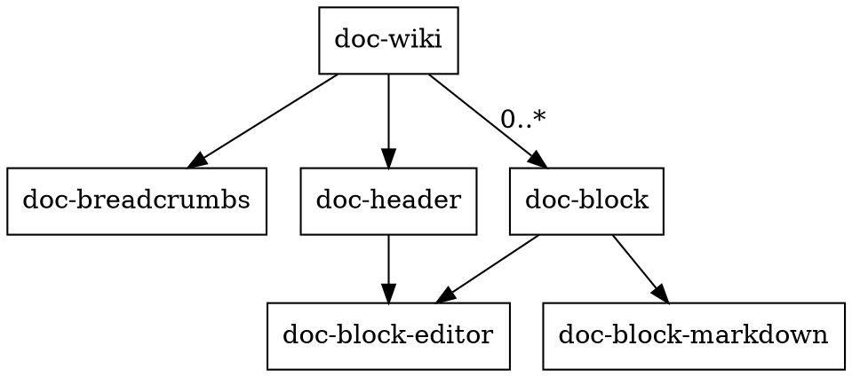

[//]: # (block)
## Abstract

Documentation often gets out of sync and is spread along many locations in multiple versions.
This project intends to provide tools, concepts and ideas to better provide up to date
and consistent documentation in a structured way.

## Technical Structure
[//]: # (block)

[//]: # (block)
The Doc Driven Wiki App is a client server application with Spring Boot for the Backend and Thymleaf in combination with VueJs in the Frontend.
The Frontend is structured in several components which are partly implemented in a Single Page Application style.

[//]: # (block)
## UI Structure

### Navigation

- Documentation supports editing of GitHub md files
- Tree-Structure navigation on the left, section navigation on the right
- Code Samples are provided in separated files and included with own styling and possibility to edit

Example <https://ant.design/components/list/> :

- Main MD file : <https://github.com/ant-design/ant-design/tree/master/components/list/index.en-US.md>
- Sample MD file : <https://github.com/ant-design/ant-design/blob/master/components/list/demo/basic.md>

## Code Editing

- VS-Code Markdown - <https://code.visualstudio.com/docs/languages/markdown> : `markdown.preview.scrollPreviewWithEditorSelection` 

## Code Execution

- Vuep (online Vue editing) - <https://cinwell.com/vuep>
- Runkit - <https://runkit.com/runkit/brain-js>
- Result as tree - <https://devblog.digimondo.io/building-a-json-tree-view-component-in-vue-js-from-scratch-in-six-steps-ce0c05c2fdd8>

## Similar products

- Kajero - <http://www.joelotter.com/kajero/>
- Markdeep - <https://casual-effects.com/markdeep/>
- API Notebook - <https://api-notebook.anypoint.mulesoft.com/>
- Daux.io - <https://daux.io>
- MDBook - <https://github.com/rust-lang-nursery/mdBook>
- Gitbook - <https://www.gitbook.com>

## Technical Base

Frameworks currently in use ...

- Vue Js - <https://vuejs.org>
- Monaco Editor - <https://github.com/Microsoft/monaco-editor>
- Markdown It - <https://github.com/markdown-it/markdown-it>
- FrontMatter - <https://github.com/jxson/front-matter>

Frameworks that would be interesting to integrate ...

- MxGraph - <https://github.com/jgraph/mxgraph>
- QuickMockup - <https://jdittrich.github.io/quickMockup/>
- Remark - <https://github.com/wooorm/remark>
- Unified - <https://github.com/unifiedjs/unified>

## Documentation Guide

- Software Architecture for Developers (by Simon Brown - <http://www.codingthearchitecture.com/authors/sbrown/>)
- Wikipedia - <https://en.wikipedia.org/wiki/Wikipedia:The_perfect_article>

```javascript
function() {
    console.log('test');
}
```

- Code-Snippet Licensing - <http://triplecheck.tech/sourcecode.html>
- Pandoc Format - <http://pandoc.org/>
- Markdown Inline content - <https://github.com/github/markup/issues/346>
- Jekyll Templates (includes) - <https://jekyllrb.com/docs/templates/>
- StackEdit - <https://stackedit.io/>
- Markdeep - <https://casual-effects.com/markdeep/>
- <https://opensource.com/life/15/8/markup-lowdown>
[//]: # (block:executable)
```javascript
var obj = {
    test: true
};
return obj;
```